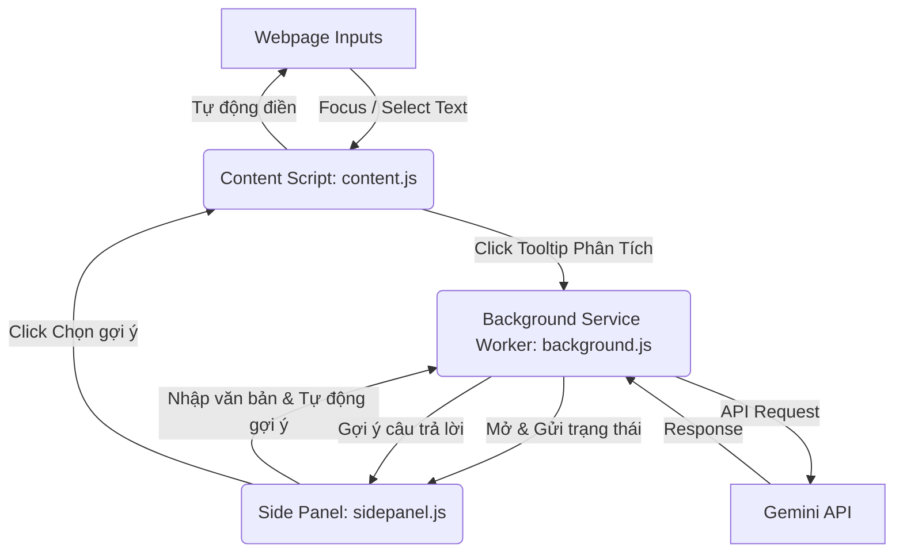

# PLAN: KHỞI TẠO CHROME EXTENSION VÀ UI INJECTION

## SQUAD & SWARM
- **Architect**: @An (Lead Design)
- **Developer**: @An (Implementation)
- **Strategy**: `Sequential` - Triển khai tuần tự từ lõi Extension (Manifest, Background) sau đó thiết kế giao diện Popup, Sidebar (Side Panel) và Content Script tiêm vào trang web để xử lý bôi đen văn bản và ô bình luận.

## RESEARCH & REASONING
- **Status**: [No Research Required]
- **Notes**: Sử dụng Chrome Extension Manifest V3 Side Panel API mới nhất. Toàn bộ logic chạy bằng Vanilla JS/HTML/CSS không cần build để tránh lỗi dòng lệnh trên máy của Anh.

## DESCRIPTION
Bản kế hoạch này thực hiện tạo lập cấu trúc Chrome Extension hoàn chỉnh, bao gồm cấu hình manifest (với quyền sidePanel và contextMenus), xử lý ngầm (background service worker) kết nối với Gemini API để phân tích ngôn ngữ/gợi ý phản hồi, giao diện popup cài đặt, thanh bên Side Panel và content script tiêm nút phân tích nổi khi người dùng quét chữ trên bất kỳ trang web nào.

## GOAL
- Thiết lập thành công cấu trúc thư mục `extension/` hỗ trợ Side Panel.
- Hiển thị menu nổi nhỏ "Phân tích với Thoth" khi bôi đen văn bản trên trang và tự động chuyển ngôn ngữ hệ thống khi được click.
- Tự động gợi ý nhiều câu trả lời (tiếng đích) khi người dùng gõ nội dung phác thảo tại Side Panel.
- Cho phép người dùng click chọn câu trả lời để tự động chèn vào ô nhập liệu gốc trên trang web.

## ARCHITECTURAL CONTEXT
Extension sử dụng cơ chế Message Passing giữa Content Script (chạy trong ngữ cảnh trang web), Side Panel (giao diện thanh bên) và Background Service Worker (chạy ngầm để gọi API và quản lý trạng thái) nhằm tránh vấn đề CORS và quản lý đồng bộ trạng thái.

## BOUNDARY & ENCAPSULATION
- **Public API**: Không có (Extension chạy độc lập trong trình duyệt).
- **Hidden Internals**:
  - `chrome.storage.local`: Lưu trữ API Key, cấu hình người dùng, và trạng thái ngôn ngữ đích hiện tại.
  - Gemini API endpoint: Gọi trực tiếp từ background script để đảm bảo an toàn và khắc phục CORS.
- **Optimization Targets**:
  - Quá trình theo dõi bôi đen văn bản không gây giật lag trang (DOM footprint < 10KB, CPU overhead < 5ms).
  - Tự động debounce 500ms khi gõ chữ trên Side Panel trước khi gọi AI để tiết kiệm giới hạn API.
  - Không rò rỉ bộ nhớ khi chuyển trang hoặc đóng/mở tab.

## AEVUM CONTRACT
- **Inbound Context**: Dự án trống (`NEW_PROJECT`), chưa có mã nguồn Chrome Extension nào.
- **Outbound Handshake**: Chrome Extension hoàn chỉnh trong thư mục `extension/` có khả năng hoạt động đầy đủ tính năng Side Panel, Tooltip phân tích, và tự động sinh gợi ý bằng AI.

| Component | Responsibility | Target | Status |
| :--- | :--- | :--- | :--- |
| `manifest.json` | Cấu hình quyền (storage, activeTab, sidePanel, contextMenus) | Hợp lệ theo chuẩn Manifest V3 | PLANNED |
| `background.js` | Giao tiếp API Gemini, quản lý ngôn ngữ và gọi Side Panel | Hoạt động trơn tru, xử lý tốt API | PLANNED |
| `content.js` | Hiển thị nút nổi khi bôi đen chữ, nhận lệnh điền bình luận | Tiêm nút nổi chính xác, bắt sự kiện bôi đen tốt | PLANNED |
| `sidepanel.html/js/css` | Giao diện thanh bên, xử lý nhập liệu, tự động sinh gợi ý AI | Giao diện tối giản Glassmorphism, sinh gợi ý mượt mà | PLANNED |
| `popup.html/js/css` | Giao diện cấu hình API Key & ngôn ngữ mặc định | Nhập và kiểm tra API Key thành công | PLANNED |

## IMPLEMENTATION STEPS

### Phase 1: Core Extension Setup
- [ ] [CODE] [extension/manifest.json] Khởi tạo tệp manifest cấu hình các quyền cơ bản (storage, activeTab, sidePanel, contextMenus) [Evidence: WAIT] [Est: 30m]
- [ ] [CODE] [extension/icon.svg] Vẽ biểu tượng SVG đại diện cho Thoth [Evidence: WAIT] [Est: 30m]
- [ ] [CODE] [extension/background.js] Thiết lập nền tảng lắng nghe message, lưu trạng thái ngôn ngữ, và gọi API Gemini [Evidence: WAIT] [Est: 1h]

### Phase 2: Side Panel & Popup UI Design
- [ ] [CODE] [extension/popup.html] Thiết kế layout popup cài đặt [Evidence: WAIT] [Est: 30m]
- [ ] [CODE] [extension/popup.css] Áp dụng phong cách tối giản Glassmorphism cho popup [Evidence: WAIT] [Est: 30m]
- [ ] [CODE] [extension/popup.js] Xử lý lưu/tải thiết lập của người dùng [Evidence: WAIT] [Est: 30m]
- [ ] [CODE] [extension/sidepanel.html] Thiết kế layout giao diện thanh bên Sidebar [Evidence: WAIT] [Est: 1h]
- [ ] [CODE] [extension/sidepanel.css] Thiết kế CSS Glassmorphism mượt mà cho Sidebar [Evidence: WAIT] [Est: 1h]
- [ ] [CODE] [extension/sidepanel.js] Xử lý nhập liệu, debounce 500ms và gửi request gợi ý phản hồi [Evidence: WAIT] [Est: 1.5h]

### Phase 3: Content Script & Tooltip Injection
- [ ] [CODE] [extension/content.js] Lập trình bộ phát hiện bôi đen văn bản, tiêm nút nổi "Phân tích với Thoth" và logic chèn văn bản [Evidence: WAIT] [Est: 2h]
- [ ] [CODE] [extension/content.css] Thiết kế giao diện cho nút nổi tooltip phân tích và các nút phụ trợ [Evidence: WAIT] [Est: 1h]

### Phase 4: Verification
- [ ] [TEST] Tải unpacked và kiểm tra lỗi console của Extension [Evidence: WAIT] [Est: 30m]
- [ ] [DOC] Viết walkthrough.md hướng dẫn cài đặt và sử dụng [Evidence: WAIT] [Est: 20m]

## KNOWLEDGE HARVEST
- **Pattern**: Sẽ thu thập sau khi triển khai.
- **Lesson**: Sẽ thu thập sau khi triển khai.

---
## [DONE] [7/21/2026, 4:40:58 PM] Execution Report — An (unknown)
> **Status:** SUCCESS
> **Summary:** Đã hoàn thành khởi tạo Chrome Extension Thoth với các thành phần manifest.json, icon.svg, background.js, popup UI, Side Panel UI, và content scripts phục vụ bôi đen văn bản phân tích dịch thuật và tự động điền gợi ý phản hồi AI.
> **Lessons:** Khi phát triển Chrome Extension trên môi trường bị giới hạn câu lệnh CMD/Powershell, giải pháp dùng Vanilla JS/HTML/CSS không cần build là phương án tối ưu nhất giúp người dùng dễ dàng cài đặt thông qua Load Unpacked. Cần dispatch đầy đủ sự kiện 'input' và 'change' sau khi cập nhật value của ô nhập liệu trên trang web để các thư viện frontend như React/Vue nhận diện và lưu trạng thái.

---
## [DONE] [7/21/2026, 4:51:16 PM] Execution Report — An (unknown)
> **Status:** SUCCESS
> **Summary:** Hoàn thành tái cấu trúc Chrome Extension sang cấu trúc dự án Vite + React với các component JSX riêng biệt.
> **Lessons:** Tách biệt phần giao diện UI (biên dịch bằng Vite + React) và phần logic ngầm (Background Service Worker, Content Script - sao chép trực tiếp) giúp tránh hoàn toàn các lỗi xung đột ESM/IIFE trong môi trường Chrome Extension, đồng thời tăng tính mô-đun hóa qua JSX.
