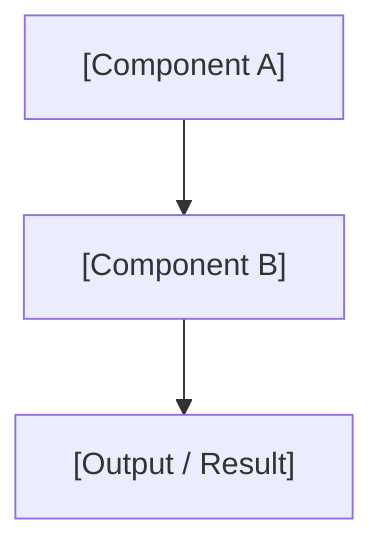

# PLAN: ${planTitle}

## SQUAD & SWARM
- **Architect:** @[Agent] (Lead Design)
- **Developer:** @[Agent] (Implementation)
- **Strategy:** `[Sequential | Incremental | Consensus]` - [Mô tả chiến lược phối hợp]

## RESEARCH & REASONING
${researchContent}

## DESCRIPTION
[Mô tả chi tiết bản kế hoạch này làm gì, tại sao cần thiết, và nó giải quyết vấn đề gì.]

## GOAL
[Phát biểu mục tiêu cụ thể, đo lường được của Plan này.]

## ARCHITECTURAL CONTEXT
[Mô tả ngắn về cách Plan này fit vào kiến trúc tổng thể.]

<!-- DIAGRAM SELECTION GUIDE (xóa comment này trước khi submit Plan):
  - Ai gọi ai?             → sequenceDiagram
  - Cái gì chứa cái gì?   → graph TD / graph LR
  - Khi nào làm gì?       → gantt
  - Trạng thái thay đổi?  → stateDiagram-v2
  - UX / User Journey?    → journey
  - Class / Interface?    → classDiagram
  - Data model?           → erDiagram
  - Use Case?             → flowchart LR (với actor nodes)
  - Một Plan có thể có nhiều diagram nếu cần.
-->

*Hình 1: [Mô tả sơ đồ kiến trúc]*

## BOUNDARY & ENCAPSULATION
- **Public API (Exports):**
  - `[Interface/Class/Function 1]`: [Mô tả vai trò lộ ra ngoài]
- **Hidden Internals:**
  - `[State/Logic nội bộ]`: [Lý do phải đóng gói chặt chẽ, không cho ngoài gọi]
- **Optimization Targets:**
  - `[Time/Space Complexity, Memory limit, etc.]`: [Mục tiêu bắt buộc]

## AEVUM CONTRACT
- **Inbound Context:** `[Precondition_State_v1]` ([Điều kiện tiên quyết để bắt đầu])
- **Outbound Handshake:** `[Postcondition_State_v1]` ([Kết quả bàn giao sau khi hoàn thành])

| Component | Responsibility | Target | Status |
| :--- | :--- | :--- | :--- |
| **[Component 1]** | [Mô tả trách nhiệm] | [KPI/SLA] | PLANNED |
| **[Component 2]** | [Mô tả trách nhiệm] | [KPI/SLA] | PLANNED |

## IMPLEMENTATION STEPS

### Phase 1: Initialization
- [ ] [CODE] [src/path/to/file.ts:L1] [Bước khởi tạo 1 — mô tả ngắn gọn] [Evidence: pending] [Est: 1h]
- [ ] [CMD] Chạy `npm run compile` — kiểm tra không có lỗi TypeScript [Evidence: auto-verified]

### Phase 2: Core Development
- [ ] [CODE] [src/path/to/file.ts:L50-80] [Bước phát triển chính 1] [Evidence: pending] [Est: 2h]
- [!] [GATE] @[Agent] phê duyệt trước khi tiếp tục [Evidence: review/session.json]
- [ ] [TEST] [tests/file.test.ts] Viết unit test — coverage > 80% [Evidence: artifacts/coverage.html]

### Phase 3: Validation & Evidence
- [ ] [TEST] Chạy toàn bộ test suite [Evidence: pending]
- [ ] [DOC] Cập nhật walkthrough.md [Evidence: walkthrough.md]
- [x] [FINISH] Hoàn tất Plan [Evidence: signed]

## KNOWLEDGE HARVEST
- **Pattern:** [Mô tả pattern mới phát hiện]
- **Lesson:** [Bài học kinh nghiệm]
