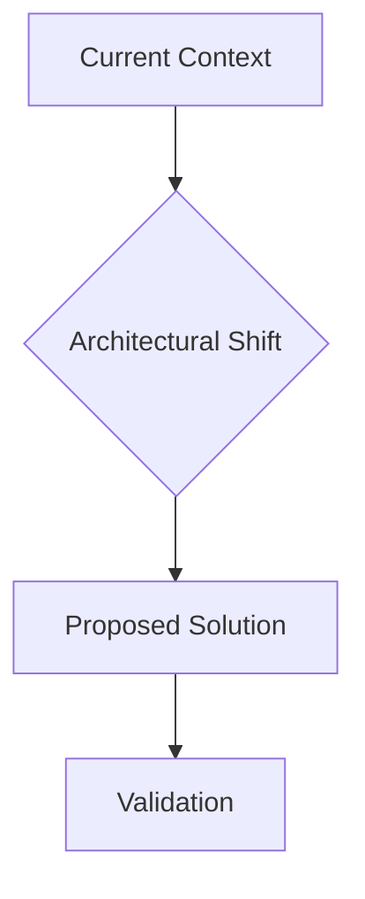

# Technical Research Paper: [Project Context]

## Table of Contents
1. [Abstract](#abstract)
2. [Introduction](#introduction)
3. [Related Work](#related-work)
4. [Methodology](#methodology)
5. [Results and Evaluation](#results-and-evaluation)
6. [Discussion](#discussion)
7. [Conclusion and Future Work](#conclusion-and-future-work)
8. [References](#references)

## Abstract
[Mô tả ngắn gọn (150-250 từ) về mục tiêu, phương pháp và kết quả quan trọng nhất của nghiên cứu.]

## Introduction
[Định nghĩa bối cảnh, lý do tại sao vấn đề lại quan trọng, các hạn chế của các giải pháp hiện tại và nêu rõ mục tiêu của nghiên cứu này.]

## Related Work
[Thảo luận về các nghiên cứu hoặc giải pháp hiện có, chỉ ra khoảng trống tri thức và giải thích cách tiếp cận này khác biệt như thế nào.]

## Methodology
Nghiên cứu sử dụng quy trình Aevum Iterative Discovery (AID) kết hợp với Deep Research Engine:
- **Phase 1: Discovery:** Thu thập dữ liệu từ đa nguồn (Web, Local Codebase, PiperNet).
- **Phase 2: Analysis:** Phân tích kỹ thuật, đối chiếu dữ liệu và phản biện kiến trúc.
- **Phase 3: Synthesis:** Tổng hợp và kết tinh thành các phát hiện hệ thống.

## Results and Evaluation
Trình bày các phát hiện chính thông qua dữ liệu thu thập được.

### Key Insights Summary

| ID | Source | Key Finding | Confidence |
| :--- | :--- | :--- | :--- |
| [INS-1] | [Source A] | [Phát hiện 1] | High |

### Detailed Analysis
[Phân tích chi tiết các khía cạnh kỹ thuật và kết quả đo lường.]

## Discussion
[Giải thích ý nghĩa của kết quả, đối chiếu với các mục tiêu ban đầu và thừa nhận các hạn chế (limitations) của nghiên cứu.]

## Conclusion and Future Work
[Tổng kết các đóng góp chính và gợi ý các hướng nghiên cứu tiềm năng trong tương lai cho hệ thống Aevum.]

## References
[Danh mục các nguồn trích dẫn được định dạng nghiêm ngặt.]

---
*Document generated by Aevum Deep Research Engine - Technical Paper Standard v2.1*

